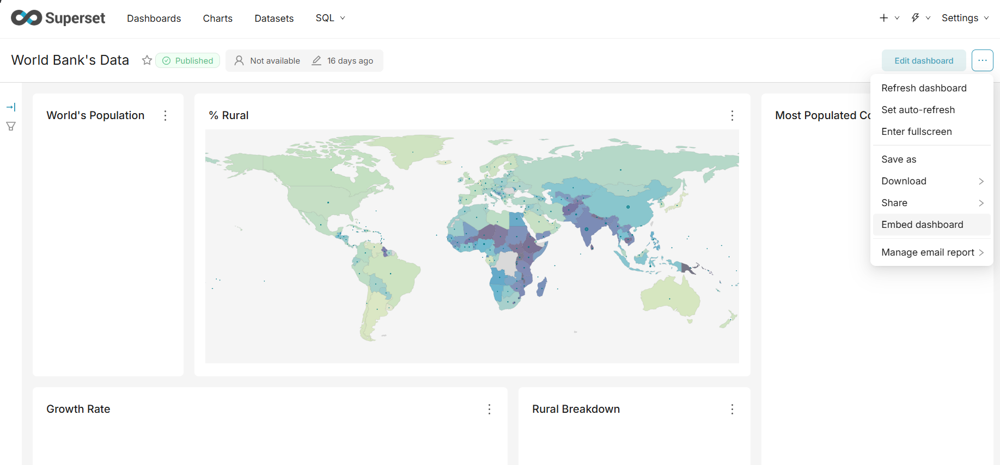
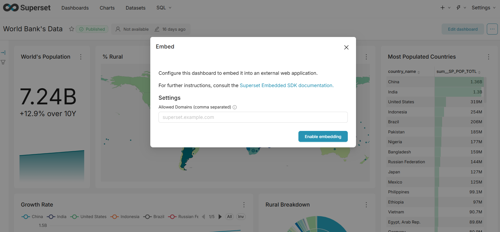
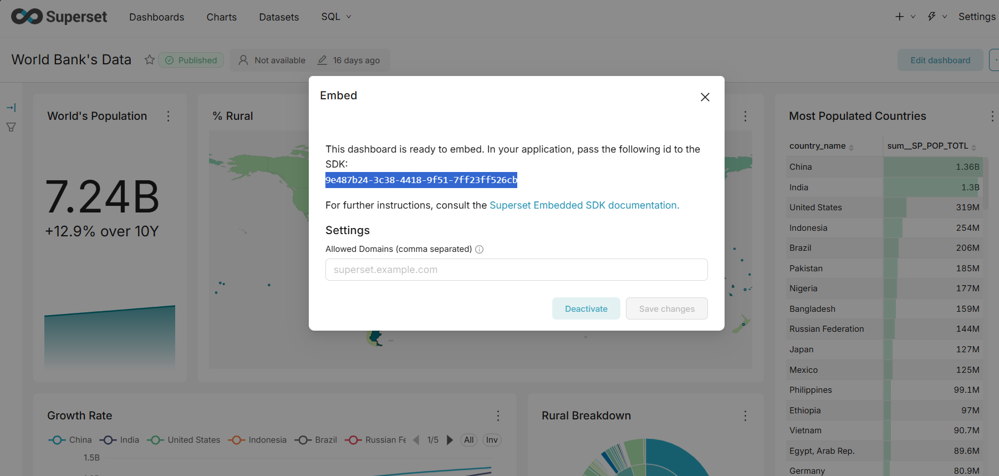
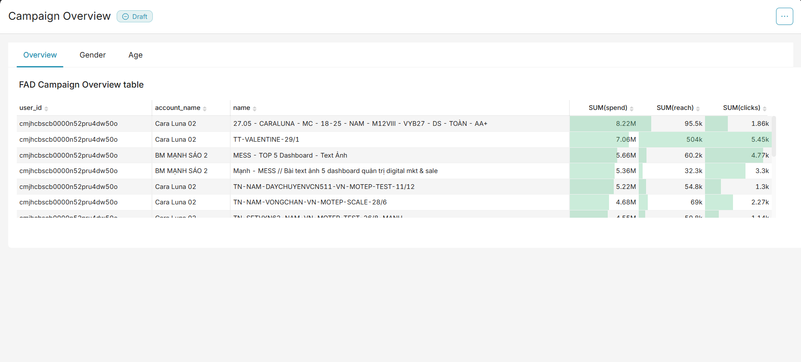

# Tài liệu Hướng dẫn: Quy trình nhúng Superset Dashboard

Quy trình nhúng một dashboard từ Apache Superset vào ứng dụng web bao gồm 2 phần chính: **Backend** (xác thực và lấy Guest Token) và **Frontend** (Superset SDK để hiển thị dashboard).

## 1. Cơ chế hoạt động tổng quan
1. **Frontend** yêu cầu hiển thị Dashboard.
2. **Frontend** gọi API nội bộ tới **Backend** để xin mã xác thực (Guest Token).
3. **Backend** thực hiện 3 bước giao tiếp với **Superset API**:
   - (1) Đăng nhập tài khoản admin để lấy `access_token`.
   - (2) Dùng `access_token` lấy `csrf_token`.
   - (3) Dùng cả 2 token trên để xin cấp `guest_token` cho người dùng khách, kèm theo các quyền truy cập và rule lọc dữ liệu (RLS).
4. **Backend** trả `guest_token` về cho **Frontend**.
5. **Frontend** dùng thư viện `supersetEmbeddedSdk` kết hợp với `guest_token` để nhúng iframe Dashboard vào trang web.

---

## 2. Phần Backend: Node.js (Tệp `server.js`)

Nhiệm vụ chính của Backend là giữ bí mật thông tin đăng nhập của hệ thống (username, password) và cấp phát token định danh an toàn cho Frontend.

### Các thiết lập quan trọng
- Cần sử dụng thư viện `axios` có hỗ trợ lưu trữ cookie (`axios-cookiejar-support` và `tough-cookie`) để Superset duy trì session.
- Thiết lập cơ chế **Retry** vì các API của Superset đôi khi có thể bị timeout.

### Chi tiết API cấp Token (`GET /guest-token`)
Khi Frontend gọi API này, Backend sẽ thực hiện tuần tự:

**Bước 1: Đăng nhập lấy Access Token**
Gọi POST `[SUPERSET_URL]/api/v1/security/login` với `username`, `password` và `provider: 'db'`. Trả về `access_token`.

**Bước 2: Lấy CSRF Token**
Gọi GET `[SUPERSET_URL]/api/v1/security/csrf_token/`, truyền header `Authorization: Bearer <access_token>`. Trả về `csrf_token`.

**Bước 3: Yêu cầu định danh khách (Guest Token)**
Gọi POST `[SUPERSET_URL]/api/v1/security/guest_token/` để tạo token giới hạn quyền. Payload bao gồm:
- `user`: Thông tin người dùng ảo (vd: username "guest").
- `resources`: Danh sách tài nguyên được phép xem, cụ thể là `type: "dashboard"` và `id` của dashboard.
- `rls` (Row Level Security): Đây là mảng cấu hình lọc dữ liệu rất quan trọng. Ví dụ: `[{ clause: "user_id = 'cmjhcbscb0000n52pru4dw50o'" }]` giúp lọc dữ liệu dashboard chỉ hiển thị thông tin của user hiện tại, đảm bảo tính bảo mật dữ liệu multi-tenant (Dataset của dashboard phải có cột này nếu không sẽ lỗi chart).

*Lưu ý ở Bước 3 cần truyền cả header `Authorization` lẫn `X-CSRFToken`, `Referer`.*

### Tham khảo chi tiết các Request/Response API Superset

**1. API Đăng nhập (Lấy Access Token & Refresh Token)**
- **Method / URL:** `POST <superset address>/api/v1/security/login`
- **Headers:** 
  - `Content-Type: application/json`
- **Payload:**
  ```json
  {
      "username": "[username tài khoản admin]",
      "password": "[password tài khoản admin]",
      "provider": "db",
      "refresh": true
  }
  ```
- **Response:**
  ```json
  {
      "access_token": "[access_token]",
      "refresh_token": "[refresh_token]"
  }
  ```

**2. API Lấy CSRF Token**
- **Method / URL:** `GET <superset address>/api/v1/security/csrf_token/`
- **Headers:**
  - `Authorization: Bearer <access_token>`
- **Response:**
  ```json
  {
      "result": "[csrf_token]"
  }
  ```

**3. API Xin Guest Token**
- **Method / URL:** `POST <superset address>/api/v1/security/guest_token/`
- **Headers:**
  - `Authorization: Bearer <access_token>`
  - `X-CSRFToken: <csrf_token>`
  - `Referer: <superset address>`
  - `Content-Type: application/json`
- **Payload:**
  ```json
  {
      "user": {
          "username": "guest",
          "first_name": "Khach",
          "last_name": "Hang"
      },
      "resources": [
          {
              "type": "dashboard",
              "id": "[embed_dashboard_id]"
          }
      ],
      "rls": [
          {
              "clause": "user_id = '[user_id]'"
          }
      ]
  }
  ```
- **Response:**
  ```json
  {
      "token": "[guest_token]"
  }
  ```

---

## 3. Phần Frontend: HTML/JS 

Frontend sử dụng thư viện chính thức của Superset để quản lý iframe và vòng đời của token.

### Các bước thực hiện

**Bước 1: Nhúng thư viện Superset Embedded SDK**
Thêm thẻ script vào phần `<head>` của trang HTML:
```html
<script src="https://unpkg.com/@superset-ui/embedded-sdk"></script>
```

**Bước 2: Chuẩn bị vùng hiển thị (Mount Point)**
Cần một thẻ (thường là `<div>`) có `id` rõ ràng và được style chiều cao/chiều rộng cụ thể để chứa iframe.
```html
<div id="my-dashboard"></div>
```

**Bước 3: Khai báo hàm lấy Token**
Hàm asynchronous gọi về backend (trong trường hợp này là `http://localhost:3010/guest-token`) để trả về chuỗi Guest Token. Tham số `fetchGuestToken` của SDK mong đợi hàm này trả về thẳng một chuỗi chuỗi token hợp lệ.

**Bước 4: Khởi tạo SDK (Hàm `embedDashboard`)**
Gọi hàm `supersetEmbeddedSdk.embedDashboard()` truyền vào các tham số cấu hình:
- `id`: Mã UUID của dashboard cần nhúng.
- `supersetDomain`: Base URL hoặc domain của máy chủ Superset đang chạy.
- `mountPoint`: DOM element (ví dụ `document.getElementById("my-dashboard")`).
- `fetchGuestToken`: Hàm lấy token đã khai báo ở Bước 3.
- `dashboardUiConfig`: Tùy chỉnh giao diện (ẩn/hiện thanh công cụ, ẩn tab, thu gọn thẻ filter mặc định...).

```javascript
await supersetEmbeddedSdk.embedDashboard({
    id: DASHBOARD_ID,
    supersetDomain: SUPERSET_DOMAIN,
    mountPoint: document.getElementById("my-dashboard"),
    fetchGuestToken: fetchTokenFromBackend,
    dashboardUiConfig: { 
        hideChartControls: true, 
        hideTab: true 
    }
});
```

---

## 4. Quy trình lấy Dashboard Embed ID

Để lấy thông tin ID của Dashboard phục vụ cho việc gọi API trên cấu hình Backend, thực hiện theo các bước sau trên giao diện ứng dụng Superset:

**Bước 1:** Tại giao diện của Dashboard, mở menu tùy chọn (biểu tượng dấu 3 chấm góc phải) và chọn **Embed dashboard**.


**Bước 2:** Bật tùy chọn **Enable embedding** để cho phép nhúng bản ghi này ra bên ngoài.


**Bước 3:** Sao chép chuỗi **Dashboard ID** hiển thị trên màn hình. Chuỗi này sẽ được sử dụng cho thuộc tính `id` trong API xin Guest Token.


---

## 5. Kết quả nhúng Dashboard

Dưới đây là giao diện Dashboard hiển thị trên ứng dụng web sau khi nhúng thành công (ví dụ áp dụng Row Level Security: dữ liệu được lọc riêng cho `user_id = cmjhcbscb0000n52pru4dw50o`):

